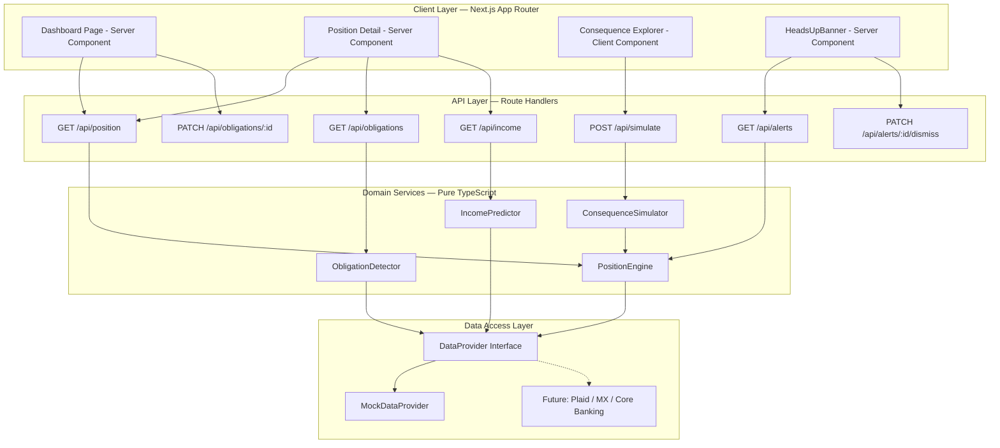
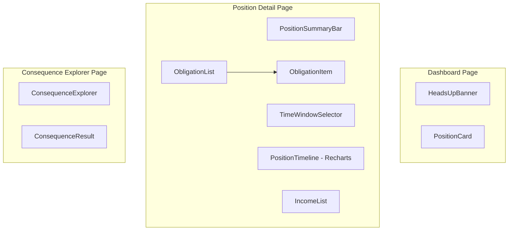

# Design Document: Financial Decision Confidence

## Overview

Financial Decision Confidence is an embedded Next.js experience that gives credit union members a clear, real-time view of their near-term financial capacity. It replaces traditional "Safe to Spend" indicators with three confidence moments:

1. **Ambient Confidence** — a dashboard Position Card showing available capacity after upcoming obligations
2. **Active Confidence** — a Consequence Explorer answering "What if I spend $X?"
3. **Protective Confidence** — proactive Heads-Up alerts when a shortfall is projected

The system is built on pure domain services that detect recurring patterns from transaction history, project daily positions, and simulate spending impacts. All business logic is framework-independent, enabling straightforward unit and property-based testing.

## Architecture



### Key Architectural Decisions

| Decision | Rationale |
|----------|-----------|
| Server Components for data-heavy views | Eliminates client fetch waterfalls; position data renders on server in <2s |
| Client Component only for Consequence Explorer | Interactive debounced input requires client state |
| Pure domain services (no framework dependency) | Trivially unit-testable, portable, enables property-based testing |
| Provider abstraction for data access | Swap MockDataProvider for Plaid/MX/Core Banking with zero logic changes |
| Integer cents for all currency | Avoids floating-point precision errors; format to dollars only at display boundary |
| No database for MVP | MockDataProvider is deterministic in-memory; simplifies deployment |
| date-fns for date arithmetic | Lightweight, tree-shakeable, immutable API |
| Recharts for timeline visualization | Lightweight SVG, accessible, React-native integration |

## Components and Interfaces

### Domain Services

```typescript
// position-engine.ts
export function calculatePosition(
  account: Account,
  obligations: Obligation[],
  income: IncomeEvent[],
  windowDays: number
): FinancialPosition;

export function generateDailyProjection(
  startBalance: number,
  obligations: Obligation[],
  income: IncomeEvent[],
  days: number
): DailyPosition[];

export function determineStatus(
  availableCapacity: number,
  totalCommitted: number,
  dailyProjection: DailyPosition[]
): PositionStatus;

export function generateAlerts(
  position: FinancialPosition,
  lookaheadDays: number
): HeadsUpAlert[];
```

```typescript
// obligation-detector.ts
export function normalizeDescription(description: string): string;

export function detectObligations(
  transactions: Transaction[]
): Obligation[];

export function classifyFrequency(
  intervals: number[]
): 'weekly' | 'biweekly' | 'monthly' | 'quarterly' | 'annual' | null;

export function predictNextDate(
  lastDate: Date,
  frequency: string,
  intervals: number[]
): Date;

export function predictAmount(
  amounts: number[]
): { expected: number; variance?: { min: number; max: number } };

export function assignConfidence(
  occurrences: number,
  amountVariance: number
): 'confirmed' | 'estimated' | 'new';
```

```typescript
// income-predictor.ts
export function detectIncome(
  transactions: Transaction[]
): IncomeEvent[];

export function filterIncomeTransactions(
  transactions: Transaction[]
): Transaction[];

export function predictNextIncomeDate(
  lastDate: Date,
  frequency: string,
  intervals: number[]
): Date;

export function predictIncomeAmount(
  amounts: number[]
): { expected: number; variance?: { min: number; max: number } };
```

```typescript
// consequence-simulator.ts
export function simulate(
  position: FinancialPosition,
  hypotheticalAmount: number
): SimulationResult;

export function identifyAtRiskObligations(
  dailyProjection: DailyPosition[]
): Obligation[];

export function determineSimulationStatus(
  revisedProjection: DailyPosition[]
): 'safe' | 'tight' | 'at-risk';
```

### Data Provider Interface

```typescript
// provider.ts
export interface DataProvider {
  getAccount(accountId: string): Promise<Account>;
  getTransactions(accountId: string, fromDate: Date, toDate: Date): Promise<Transaction[]>;
  getScheduledPayments(accountId: string): Promise<Obligation[]>;
}
```

### API Route Handlers

| Endpoint | Method | Returns | Domain Service |
|----------|--------|---------|----------------|
| `/api/position?window=7\|14\|30` | GET | `FinancialPosition` | PositionEngine |
| `/api/obligations` | GET | `Obligation[]` | ObligationDetector |
| `/api/obligations/:id` | PATCH | `Obligation` | ObligationDetector (confirm/dismiss/adjust) |
| `/api/income` | GET | `IncomeEvent[]` | IncomePredictor |
| `/api/simulate` | POST | `SimulationResult` | ConsequenceSimulator |
| `/api/alerts` | GET | `Alert[]` | PositionEngine |
| `/api/alerts/:id/dismiss` | PATCH | `void` | PositionEngine |

### UI Components



| Component | Type | Responsibilities |
|-----------|------|-----------------|
| `PositionCard` | Server | Dashboard summary: balance, committed, available capacity, next obligation/income |
| `PositionTimeline` | Client | Recharts AreaChart with obligation/income markers |
| `PositionSummaryBar` | Server | Balance / committed / available numeric display |
| `ObligationList` | Server | Chronological list of upcoming obligations |
| `ObligationItem` | Client | Individual obligation with confirm/dismiss/adjust actions |
| `IncomeList` | Server | List of expected income events |
| `ConsequenceExplorer` | Client | Numeric input with debounce, triggers simulation |
| `ConsequenceResult` | Client | Before/after display, risk indicators, at-risk obligations |
| `HeadsUpBanner` | Server | Informational alert with calm styling |

## Data Models

```typescript
interface Account {
  id: string;
  name: string;
  type: 'checking' | 'savings';
  currentBalance: number;       // integer cents
  availableBalance: number;     // integer cents
  lastUpdated: Date;
}

interface Transaction {
  id: string;
  accountId: string;
  amount: number;               // integer cents, negative = outflow
  date: Date;
  description: string;
  category: TransactionCategory;
  merchant?: string;
  isRecurring: boolean;
  recurringGroupId?: string;
}

interface Obligation {
  id: string;
  accountId: string;
  name: string;
  expectedAmount: number;       // integer cents
  amountVariance?: { min: number; max: number };
  expectedDate: Date;
  frequency: 'weekly' | 'biweekly' | 'monthly' | 'quarterly' | 'annual';
  confidence: 'confirmed' | 'estimated' | 'new';
  lastPaidDate: Date;
  lastPaidAmount: number;
  isActive: boolean;
}

interface IncomeEvent {
  id: string;
  accountId: string;
  source: string;
  expectedAmount: number;       // integer cents
  amountVariance?: { min: number; max: number };
  expectedDate: Date;
  frequency: 'weekly' | 'biweekly' | 'monthly' | 'irregular';
  confidence: 'confirmed' | 'estimated';
  lastReceivedDate: Date;
  lastReceivedAmount: number;
}

interface FinancialPosition {
  accountId: string;
  calculatedAt: Date;
  currentBalance: number;       // integer cents
  totalCommitted: number;       // integer cents
  availableCapacity: number;    // integer cents
  timeWindow: number;           // days
  obligations: Obligation[];
  expectedIncome: IncomeEvent[];
  dailyProjection: DailyPosition[];
  status: 'comfortable' | 'watch' | 'tight';
}

interface DailyPosition {
  date: Date;
  projectedBalance: number;     // integer cents
  obligations: Obligation[];
  income: IncomeEvent[];
  cumulativeOutflow: number;    // integer cents
  cumulativeInflow: number;     // integer cents
}

interface SimulationResult {
  hypotheticalAmount: number;   // integer cents
  revisedCapacity: number;      // integer cents
  dailyProjection: DailyPosition[];
  atRiskObligations: Obligation[];
  status: 'safe' | 'tight' | 'at-risk';
  shortfallDate?: Date;
  shortfallAmount?: number;     // integer cents
}

interface HeadsUpAlert {
  id: string;
  accountId: string;
  generatedAt: Date;
  shortfallDate: Date;
  shortfallAmount: number;      // integer cents
  causingObligations: Obligation[];
  isDismissed: boolean;
  message: string;
}

type TransactionCategory =
  | 'income_payroll' | 'income_transfer' | 'income_other'
  | 'housing' | 'utilities' | 'insurance' | 'transportation'
  | 'subscription' | 'loan_payment' | 'food_grocery' | 'food_dining'
  | 'healthcare' | 'personal' | 'transfer_out' | 'other';

type PositionStatus = 'comfortable' | 'watch' | 'tight';
```

### Mock Data: "Sarah" Profile

The MVP uses a deterministic mock data generator seeded from a configurable reference date:

| Item | Details |
|------|---------|
| Account balance | ~$2,400 checking |
| Primary income | Biweekly payroll $2,847 net (every other Friday) |
| Secondary income | Irregular gig $150–$300 |
| Obligations (9) | Rent $1,250 (1st), Car $389 (15th), Insurance $127 (22nd), Electric $95–$165 (~12th), Phone $85 (18th), Streaming $22.99 (5th), Gym $49.99 (1st), Internet $69.99 (8th), Student loan $275 (20th) |
| History depth | 90+ days of transactions |
| Generation | Deterministic from seed date, all amounts in integer cents |

## Correctness Properties

*A property is a characteristic or behavior that should hold true across all valid executions of a system — essentially, a formal statement about what the system should do. Properties serve as the bridge between human-readable specifications and machine-verifiable correctness guarantees.*

### Property 1: Position Arithmetic Invariant

*For any* account balance and set of obligations within a time window, the Position_Engine SHALL satisfy the invariant: `availableCapacity === currentBalance - totalCommitted`.

**Validates: Requirements 1.2, 1.3**

### Property 2: Obligation Chronological Ordering

*For any* set of obligations returned by the Position_Engine or Obligation_Detector, the output array SHALL be sorted in non-decreasing order by `expectedDate`.

**Validates: Requirements 1.4, 2.10**

### Property 3: Time Window Monotonicity

*For any* account and set of obligations, if time window W2 > W1, then `totalCommitted(W2) >= totalCommitted(W1)` — a longer window never reduces the committed total.

**Validates: Requirements 1.7**

### Property 4: Position Status Threshold Correctness

*For any* financial position, the assigned status SHALL be: `comfortable` when availableCapacity > 20% of totalCommitted, `watch` when 0 < availableCapacity ≤ 20% of totalCommitted, and `tight` when any day in the daily projection has a negative balance.

**Validates: Requirements 1.8**

### Property 5: Recurrence Detection Threshold

*For any* set of transactions grouped by normalized merchant, the Obligation_Detector SHALL classify a group as a recurring obligation if and only if the group contains 3 or more occurrences.

**Validates: Requirements 2.2, 6.6**

### Property 6: Next Date Prediction from Frequency

*For any* recurring obligation or income event with a detected frequency and historical intervals, the predicted next date SHALL equal the last occurrence date plus the median interval (within the frequency's tolerance window).

**Validates: Requirements 2.3, 3.3**

### Property 7: Median Amount for Stable Patterns

*For any* recurring obligation or income event with amount variance ≤ 5%, the predicted expected amount SHALL equal the median of historical amounts.

**Validates: Requirements 2.4, 3.4**

### Property 8: Range Prediction for Variable Patterns

*For any* recurring obligation or income event with amount variance > 5%, the predicted range SHALL have `min` equal to the minimum historical amount and `max` equal to the maximum historical amount.

**Validates: Requirements 2.5, 3.5**

### Property 9: Confidence Assignment by Variance

*For any* detected obligation, confidence SHALL be `confirmed` when amount variance ≤ 5% AND occurrences ≥ 5, `estimated` when variance > 5% OR occurrences are 3–4, and `new` on first detection.

**Validates: Requirements 1.5, 2.6**

### Property 10: Dismissed Obligation Exclusion

*For any* financial position calculation, if an obligation is marked as dismissed (`isActive === false`), it SHALL NOT be included in the `totalCommitted` sum or the `obligations` array of the resulting position.

**Validates: Requirements 2.8**

### Property 11: Income Filtering Excludes Transfers

*For any* set of transactions, the Income_Predictor SHALL only consider inbound transactions (positive amounts) that are NOT categorized as `income_transfer` when detecting income patterns.

**Validates: Requirements 3.1**

### Property 12: Income Occurrence Threshold

*For any* set of inbound transactions grouped by source, the Income_Predictor SHALL classify a group as recurring income if and only if the group contains 3 or more occurrences.

**Validates: Requirements 3.2**

### Property 13: Consequence Simulation Arithmetic

*For any* financial position and hypothetical spending amount, the Consequence_Simulator SHALL produce a result where `revisedCapacity === position.availableCapacity - hypotheticalAmount`.

**Validates: Requirements 4.1**

### Property 14: Consequence Simulation Status Correctness

*For any* simulation result, the status SHALL be `safe` when no day in the revised projection has a negative balance, `tight` when the minimum projected balance is between 0 and 10% of total committed, and `at-risk` when any day has a negative balance — with `atRiskObligations` containing exactly those obligations scheduled on or after the first negative-balance day.

**Validates: Requirements 4.3, 4.7**

### Property 15: Alert Generation Threshold

*For any* financial position with a 7-day lookahead, a Heads_Up_Alert SHALL be generated if and only if the daily projection shows available capacity dropping below zero within those 7 days. When capacity is low but remains positive, status SHALL be `watch` with no alert generated.

**Validates: Requirements 5.1, 5.4**

### Property 16: Alert Lead Time

*For any* generated Heads_Up_Alert, the alert's `generatedAt` timestamp SHALL be at least 48 hours before the `shortfallDate`.

**Validates: Requirements 5.2**

### Property 17: Alert Causation Completeness

*For any* generated Heads_Up_Alert, the `causingObligations` array SHALL contain exactly the obligations whose expected dates fall on or after the date when cumulative outflow exceeds available funds, and `shortfallAmount` SHALL equal the deficit on the shortfall date.

**Validates: Requirements 5.3**

### Property 18: Description Normalization Idempotence

*For any* merchant description string, applying `normalizeDescription` twice SHALL produce the same result as applying it once: `normalize(normalize(x)) === normalize(x)`.

**Validates: Requirements 2.1**

### Property 19: Prediction Refinement Monotonic Accuracy

*For any* recurring pattern with N occurrences, adding a new occurrence (N+1) SHALL produce a prediction that incorporates the new data point — specifically, the new predicted amount SHALL be the median of all N+1 amounts.

**Validates: Requirements 6.3, 6.4**

### Property 20: Currency Formatting Round-Trip Consistency

*For any* integer cents value, formatting to display currency and parsing back to cents SHALL produce the original value: `parseCents(formatCurrency(cents)) === cents`.

**Validates: Requirements 8.6**

### Property 21: Low-Confidence Income Exclusion

*For any* income event with confidence below the `estimated` threshold, the Position_Engine SHALL exclude it from `expectedIncome` in the position calculation, resulting in `availableCapacity` that does not account for that income.

**Validates: Requirements 10.2**

## Error Handling

### Domain Service Errors

| Scenario | Handling |
|----------|----------|
| Empty transaction history | Return position with current balance only, empty obligations/income, status = "comfortable" |
| Insufficient history (<90 days) | Calculate with available data, include "learning patterns" flag in response |
| Invalid account data (missing balance) | Throw typed `DataProviderError`; API layer returns 500 with safe message |
| Calculation overflow (unlikely with integer cents) | Use safe arithmetic helpers; log warning if amounts exceed 32-bit range |

### API Layer Errors

| Scenario | HTTP Status | Response |
|----------|-------------|----------|
| Valid request | 200 | JSON response body |
| Invalid query params (e.g., window=99) | 400 | `{ error: "Invalid time window. Use 7, 14, or 30." }` |
| Obligation not found for PATCH | 404 | `{ error: "Obligation not found." }` |
| Domain calculation error | 500 | `{ error: "Unable to calculate position. Please try again." }` |
| Data provider unavailable | 503 | `{ error: "Data temporarily unavailable." }` |

### Client Layer Errors

| Scenario | UX Behavior |
|----------|-------------|
| API fetch failure | Display cached position with stale-data indicator; retry on page focus |
| Simulation API timeout | Show "Taking longer than expected..." message; allow retry |
| Empty simulation input | Display current position without modification |
| Position_Engine returns error flag | Show current balance only with "We're having trouble calculating your full position" message |
| First-time member (no patterns detected) | Show balance + "We're learning your patterns. As recurring payments appear, they'll show here." |

## Testing Strategy

### Property-Based Tests (fast-check)

The project uses **fast-check** as the property-based testing library for TypeScript. Each correctness property maps to a dedicated test with minimum 100 iterations.

**Configuration:**
```typescript
import fc from 'fast-check';

// Minimum 100 iterations per property
const PBT_CONFIG = { numRuns: 100 };
```

**Generators needed:**
- `arbitraryAccount()` — random Account with valid balance in cents
- `arbitraryObligation(dateRange)` — random Obligation within a date range
- `arbitraryIncomeEvent(dateRange)` — random IncomeEvent within a date range
- `arbitraryTransaction(dateRange)` — random Transaction with category
- `arbitraryMerchantDescription()` — random merchant strings including edge cases
- `arbitraryCentsAmount()` — positive integer cents (1–10,000,000)

**Test file structure:**
```
src/__tests__/domain/
├── position-engine.property.test.ts    (Properties 1–4, 15–17, 21)
├── obligation-detector.property.test.ts (Properties 5–9, 10, 18, 19)
├── income-predictor.property.test.ts   (Properties 6–8, 11, 12, 19)
├── consequence-simulator.property.test.ts (Properties 13–14)
└── formatting.property.test.ts         (Property 20)
```

Each test is tagged:
```typescript
// Feature: financial-decision-confidence, Property 1: Position Arithmetic Invariant
```

### Unit Tests (Vitest)

Unit tests complement property tests with specific examples, edge cases, and error conditions:

- **Position Engine**: specific scenarios with Sarah's mock data, edge cases (zero balance, single obligation, empty window)
- **Obligation Detector**: known transaction sequences, boundary cases (exactly 3 occurrences, exactly 5% variance)
- **Income Predictor**: regular payroll detection, gig income handling, transfer exclusion
- **Consequence Simulator**: specific spend amounts against Sarah's position, zero/negative input
- **Formatting utilities**: specific currency values, locale edge cases
- **Components**: render tests for PositionCard, ConsequenceExplorer, HeadsUpBanner with known data

### Integration Tests

- API route handlers return correct shapes for valid/invalid requests
- End-to-end: MockDataProvider → Domain Services → API → JSON response
- Alert generation triggered correctly from full position calculation

### Test Commands

```bash
# Run all tests (single execution)
npx vitest --run

# Run property tests only
npx vitest --run src/__tests__/domain/*.property.test.ts

# Run unit tests only
npx vitest --run src/__tests__/domain/*.test.ts src/__tests__/components/*.test.tsx
```
